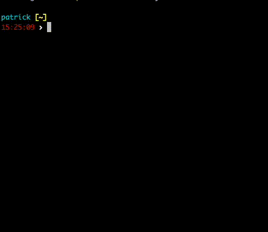

# kxd - Kubeconfig Switcher

kxd is a command-line utility that allows you to easily switch between Kubernetes configuration files (kubeconfig) and contexts. This tool is designed to simplify the management of multiple Kubernetes clusters and contexts.



## Features

- Switch between different kubeconfig files.
- Switch between Kubernetes contexts within a kubeconfig file.

## Installation

Make sure you have Go installed. You can download it from [here](https://golang.org/dl/).

### Homebrew

```bash
brew tap radiusmethod/kxd
brew install kxd
```

or just

```bash
brew install radiusmethod/kxd/kxd
```
### Makefile

```bash
make install
```

### To Finish Installation
Add the following to your bash profile or zshrc then open new terminal or source that file

```sh
alias kxd="source _kxd"
```

Ex. `echo -ne '\nalias kxd="source _kxd"' >> ~/.zshrc`

## Configuration

By default, Kubeconfig Switcher looks for files with an extension of `.conf`. You can customize the behavior by setting an environment variable.
This can be a single matcher or a comma seperated string for multiple matchers.

- `KXD_MATCHER`: The file matcher(s) used to identify kubeconfig files (default is `.conf`).

## Usage

 * See docs for more info [kxd](docs/kxd.md)

### Switching Kubeconfig Files

To switch between different kubeconfig files, use the following command:

```bash
kxd f s
```

This command will display a list of available kubeconfig files in your `~/.kube` directory. Select the one you want to use.

### Switching Kubernetes Contexts

To switch between Kubernetes contexts within a kubeconfig file, use the following command:

```bash
kxd ctx s
```

This command will display a list of available contexts in your current kubeconfig file. Select the one you want to switch to.


### Getting Current Kubeconfig or Kubernetes Context

To get the currently set Kubeconfig or Kubernetes Context, use the following commands:

```bash
kxd f c
```

This command will display the currently set kubeconfig file.

```bash
kxd ctx c
```

This command will display the currently set Kubernetes Context.

### Version

To check the version of Kubeconfig Switcher, use the following command:

```bash
kxd version
```

### Show your set kubeconfig in your shell prompt
For better visibility into what your shell is set to it can be helpful to configure your prompt to show the value of the env variable `KUBECONFIG`.


Here's a sample of my zsh prompt config using oh-my-zsh themes

```sh
# Kubeconfig info
local kxd_info='$(kxd_config)'
function kxd_config {
  local config="${KUBECONFIG:=}"
    if [ -z "$config" ]
    then
          echo -n ""
    else
          config=$(basename $config)
          echo -n "%{$fg_bold[blue]%}kx:(%{$fg[cyan]%}${config}%{$fg_bold[blue]%})%{$reset_color%} "
    fi
}
```

```sh
PROMPT='OTHER_PROMPT_STUFF $(kxd_info)'
```

## Contributing

If you encounter any issues or have suggestions for improvements, please open an issue or create a pull request on [GitHub](https://github.com/radiusmethod/kxd).

## License

This project is licensed under the MIT License - see the [LICENSE](LICENSE) file for details.
