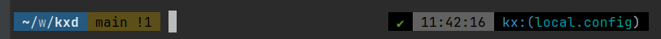

# kxd - Kubeconfig Switcher


kxd is a command-line utility that allows you to easily switch between Kubernetes configuration files (kubeconfig) contexts. This tool is designed to simplify the management of multiple Kubernetes clusters and contexts.


## Features

- Switch between different kubeconfig files.
- Switch between Kubernetes contexts within a kubeconfig file.
- Switch between Kubernetes namespaces in a context.

## Table of Contents

- [Installation](#installation)
    - [Homebrew](#homebrew)
    - [Makefile](#makefile)
    - [To Finish Installation](#to-finish-installation)
    - [Upgrading](#upgrading)
    - [Configuration](#configuration)
- [Usage](#usage)
    - [Switching Kubeconfig Files](#switching-kubeconfig-files)
    - [Switching Kubernetes Contexts](#switching-kubernetes-contexts)
    - [Switching Kubernetes Context Namespaces](#switching-kubernetes-context-namespaces)
    - [Getting Current Kubeconfig, Kubernetes Context or Context Namespace](#getting-current-kubeconfig-kubernetes-context-or-context-namespace)
    - [Version](#version)
    - [Persist KUBECONFIG across new shells](#persist-kubeconfig-across-new-shells)
    - [Show your set kubeconfig in your shell prompt](#show-your-set-kubeconfig-in-your-shell-prompt)
    - [Add autocompletion](#add-autocompletion)
    - [TL;DR (full config example)](#tldr-full-config-example)
- [Contributing](#contributing)
- [License](#license)

## Installation

Make sure you have Go installed. You can download it from [here](https://golang.org/dl/).

### Homebrew

```bash
brew tap radiusmethod/kxd
brew install kxd
```

or just

```bash
brew install radiusmethod/kxd/kxd
```
### Makefile

```bash
make install
```

### To Finish Installation
Add the following to your bash profile or zshrc then open new terminal or source that file

```sh
alias kxd="source _kxd"
```

Ex. `echo -ne '\nalias kxd="source _kxd"' >> ~/.zshrc`

### Upgrading
Upgrading consists of just doing a brew update and brew upgrade.

```sh
brew update && brew upgrade radiusmethod/kxd/kxd
```

## Configuration

By default, Kubeconfig Switcher looks for files with an extension of `.conf`. You can customize the behavior by setting an environment variable.
This can be a single matcher or a comma seperated string for multiple matchers.

- `KXD_MATCHER`: The file matcher(s) used to identify kubeconfig files (default is `.conf`).

## Usage

 * See docs for more info [kxd](docs/kxd.md)

### Switching Kubeconfig Files

It is possible to shortcut the menu selection by passing the config name you want to switch to as an argument.

```bash
> kxd dev.conf
Config dev.conf set.
```

To switch between different kubeconfig files using the menu, use the following command:

```bash
kxd f s
```

This command will display a list of available kubeconfig files in your `~/.kube` directory. Select the one you want to use.

### Switching Kubernetes Contexts

To switch between Kubernetes contexts within a kubeconfig file, use the following command:

```bash
kxd ctx s
```

This command will display a list of available contexts in your current kubeconfig file. Select the one you want to switch to.

### Switching Kubernetes Context Namespaces

To switch between Kubernetes context namespaces within a kubeconfig context, use the following command:

```bash
kxd ns s
```

This command will display a list of kubernetes namespaces in your currently set cluster. Select the one you want to switch to.


### Getting Current Kubeconfig, Kubernetes Context or Context Namespace

To get the currently set Kubeconfig, Kubernetes Context or Context Namespace, use the following commands:

```bash
kxd f c
```

This command will display the currently set kubeconfig file.

```bash
kxd ctx c
```

This command will display the currently set Kubernetes Context.

```bash
kxd ns c
```

This command will display the currently set Kubernetes Context Namespace.

### Version

To check the version of Kubeconfig Switcher, use the following command:

```bash
kxd version
```

## Persist KUBECONFIG across new shells
To persist the set config when you open new terminal windows, you can add the following to your bash profile or zshrc.

```bash
export KUBECONFIG=$(kxd file current)
```

### Show your set kubeconfig in your shell prompt
For better visibility into what your shell is set to it can be helpful to configure your prompt to show the value of the env variable `KUBECONFIG`.


Here's a sample of my zsh prompt config using oh-my-zsh themes

```sh
# Kubeconfig info
local kxd_info='$(kxd_config)'
function kxd_config {
  local config="${KUBECONFIG:=}"
    if [ -z "$config" ]
    then
          echo -n ""
    else
          config=$(basename $config)
          echo -n "%{$fg_bold[blue]%}kx:(%{$fg[cyan]%}${config}%{$fg_bold[blue]%})%{$reset_color%} "
    fi
}
```

```sh
PROMPT='OTHER_PROMPT_STUFF $(kxd_info)'
```

To include prompt support in OhMyZsh, add the following lines to your `~/.p10k.zsh` file:

```sh
# kxd prompts
typeset -g _kxd_config
typeset -g _kxd_basename=''
typeset -g _kxd_content="kx:(${_kxd_basename})"

function prompt_kxd() {
local _kxd_config="${KUBECONFIG:=}"
if [ -z "$_kxd_config" ]
then
  _kxd_basename=''
else
  _kxd_basename="%F{cyan}$(basename $_kxd_config)%f"
fi

_kxd_content="kx:(${_kxd_basename})"
p10k segment -b 0 -f 4 -t ${_kxd_content}
}

function instant_prompt_kxd() {
p10k segment -b 0 -f 4 -t ${_kxd_content}
}
```

Then add `kxd` to either your left or right prompt segments.



## Add autocompletion
You can add autocompletion when passing config as argument by adding the following to your bash profile or zshrc file.
`source _kxd_autocomplete`

Now you can do `kxd my-k` and hit tab and if you had a config `my-kubeconfig` it would autocomplete and find it.

## TL;DR (full config example)
```sh
alias kxd="source _kxd"
source _kxd_autocomplete
export KXD_MATCHER="-config,.conf"
export KUBECONFIG=$(kxd file current)
```

## Contributing

If you encounter any issues or have suggestions for improvements, please open an issue or create a pull request on [GitHub](https://github.com/radiusmethod/kxd).

## License

This project is licensed under the MIT License - see the [LICENSE](LICENSE) file for details.
