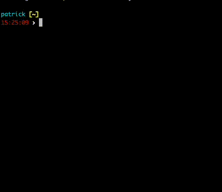
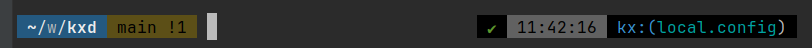

# kxd - Kubeconfig Switcher


kxd is a command-line utility that allows you to easily switch between Kubernetes configuration files (kubeconfig) contexts. This tool is designed to simplify the management of multiple Kubernetes clusters and contexts.



## Features

- Switch between different kubeconfig files.
- Switch between Kubernetes contexts within a kubeconfig file.
- Switch between Kubernetes namespaces in a context.

## Table of Contents

- [Installation](#installation)
    - [Homebrew](#homebrew)
    - [Prebuilt binary](#prebuilt-binary)
    - [Makefile](#makefile)
    - [To Finish Installation](#to-finish-installation)
    - [Upgrading](#upgrading)
    - [Upgrading from pre-v0.2.0](#upgrading-from-pre-v020)
    - [Windows](#windows)
    - [Configuration](#configuration)
- [Usage](#usage)
    - [Switching Kubeconfig Files](#switching-kubeconfig-files)
    - [Switching Kubernetes Contexts](#switching-kubernetes-contexts)
    - [Switching Kubernetes Context Namespaces](#switching-kubernetes-context-namespaces)
    - [Getting Current Kubeconfig, Kubernetes Context or Context Namespace](#getting-current-kubeconfig-kubernetes-context-or-context-namespace)
    - [Version](#version)
    - [Show your set kubeconfig in your shell prompt](#show-your-set-kubeconfig-in-your-shell-prompt)
    - [Add autocompletion](#add-autocompletion)
- [Why a shell function?](#why-a-shell-function)
- [Contributing](#contributing)
- [License](#license)

## Installation

### Homebrew

```bash
brew tap radiusmethod/kxd
brew install kxd
```

or just

```bash
brew install radiusmethod/kxd/kxd
```

### Prebuilt binary

Grab the archive for your platform from the
[latest release](https://github.com/radiusmethod/kxd/releases/latest), then put `kxd` somewhere on
your `PATH`. macOS, Linux, and Windows on amd64 and arm64.

### Makefile

Builds from source, so this one needs [Go](https://golang.org/dl/) installed.

```bash
make install
```

### To Finish Installation
Add one line to your shell's startup file, then open a new terminal or source that file.

**zsh** (`~/.zshrc`):
```sh
eval "$(kxd init zsh)"
```

**bash** (`~/.bashrc` or `~/.bash_profile`):
```sh
eval "$(kxd init bash)"
```

**fish** (`~/.config/fish/config.fish`):
```fish
kxd init fish | source
```

**PowerShell** (`$PROFILE`):
```powershell
kxd init powershell | Out-String | Invoke-Expression
```

Ex. `echo 'eval "$(kxd init zsh)"' >> ~/.zshrc`

That one line defines the `kxd` shell function, sets up tab completion, and applies the kubeconfig
you last selected to every new shell. Nothing else to configure.

### Upgrading
Upgrading consists of just doing a brew update and brew upgrade.

```sh
brew update && brew upgrade radiusmethod/kxd/kxd
```

### Upgrading from pre-v0.2.0
**v0.2.0 is a breaking change.** kxd now installs one binary named `kxd`. The old `_kxd_prompt`
binary, the `_kxd` wrapper script, `_kxd_autocomplete`, and both `.ps1` wrappers are gone, along
with the alias-based setup.

The single `eval` line above replaces all of this, so delete whatever you have of it:

```sh
alias kxd="source _kxd"              # removed in v0.2.0
source _kxd_autocomplete             # removed in v0.2.0
export KUBECONFIG=$(kxd file current) # no longer needed, init applies it
```

Keep your `KXD_MATCHER` line if you set one. Then clear out the old files, which a package manager
will not remove for you if you ever ran `make install` by hand:

```sh
rm -f /usr/local/bin/_kxd_prompt /usr/local/bin/_kxd /usr/local/bin/_kxd_autocomplete
type -a _kxd_prompt   # should print nothing
```

Two things that bite during the upgrade:

- **Remove the old alias.** In zsh an alias shadows a function of the same name, so leaving
  `alias kxd="source _kxd"` in place means the new `kxd` function never gets used. If the alias is
  defined *before* the `eval` line, the eval fails outright with
  `defining function based on alias 'kxd'`.
- **Put the `eval` line after any `PATH` changes** that point at your kxd install, and after
  `KXD_MATCHER` is exported. It runs `kxd` at startup, so an older copy earlier in `PATH` at that
  moment produces confusing errors. `type -a kxd` shows you every copy.

Your `~/.kxd` file carries over untouched, so your selected kubeconfig survives the upgrade.

### Windows

Releases include Windows binaries for amd64 and arm64, and `kxd init powershell` generates the
PowerShell integration, so there is nothing to copy by hand.

#### Native PowerShell

Download the Windows archive from the
[latest release](https://github.com/radiusmethod/kxd/releases/latest), put `kxd.exe` on your
`$env:PATH`, then add this to your profile (open it with `notepad $PROFILE`):

```powershell
kxd init powershell | Out-String | Invoke-Expression
```

Restart PowerShell. `kxd` is now a function in your session, with tab completion, and your
selected kubeconfig is applied to every new session.

Building from source instead needs [Go](https://golang.org/dl/):

```powershell
make -f Makefile_Windows install    # builds kxd.exe into C:\tools\kxd, override with BINDIR=...
```

#### WSL

From a WSL2 Ubuntu/Debian shell, follow the standard Linux instructions exactly. From WSL's
perspective it's just Linux.

Caveat: the `KUBECONFIG` you set inside WSL is **not** visible to `kubectl.exe` invoked from
PowerShell or `cmd`. Run `kubectl` from WSL too, or set the env var separately on the Windows side.

#### Git Bash / MSYS2

Put `kxd.exe` on your Git Bash `PATH` and add `eval "$(kxd init bash)"` to `~/.bashrc`. Make sure
`~/.kube/` exists with your config files; in Git Bash, `~` resolves to `C:\Users\<you>`.

Untested by the maintainers. `~/.kube/config` symlinks created on the Windows side sometimes
confuse path resolution.

kxd reads and writes `$HOME\.kxd` and `$HOME\.kube\<name>` on every platform, so configs
interoperate between PowerShell, WSL, and Git Bash on the same machine if you point them at the
same `.kube` directory.

## Configuration

By default, Kubeconfig Switcher looks for files with an extension of `.conf`. You can customize the behavior by setting an environment variable.
This can be a single matcher or a comma seperated string for multiple matchers.

- `KXD_MATCHER`: The file matcher(s) used to identify kubeconfig files (default is `.conf`).

## Usage

 * See docs for more info [kxd](docs/kxd.md)

### Switching Kubeconfig Files

It is possible to shortcut the menu selection by passing the config name you want to switch to as an argument.

```bash
> kxd dev.conf
Config dev.conf set.
```

To switch between different kubeconfig files using the menu, use the following command:

```bash
kxd f s
```

This command will display a list of available kubeconfig files in your `~/.kube` directory. Select the one you want to use.

### Switching Kubernetes Contexts

To switch between Kubernetes contexts within a kubeconfig file, use the following command:

```bash
kxd ctx s
```

This command will display a list of available contexts in your current kubeconfig file. Select the one you want to switch to.

### Switching Kubernetes Context Namespaces

To switch between Kubernetes context namespaces within a kubeconfig context, use the following command:

```bash
kxd ns s
```

This command will display a list of kubernetes namespaces in your currently set cluster. Select the one you want to switch to.


### Getting Current Kubeconfig, Kubernetes Context or Context Namespace

To get the currently set Kubeconfig, Kubernetes Context or Context Namespace, use the following commands:

```bash
kxd f c
```

This command will display the currently set kubeconfig file.

```bash
kxd ctx c
```

This command will display the currently set Kubernetes Context.

```bash
kxd ns c
```

This command will display the currently set Kubernetes Context Namespace.

### Version

To check the version of Kubeconfig Switcher, use the following command:

```bash
kxd version
```

Your selection persists across new terminal windows automatically, since `kxd init` applies
whatever is in `~/.kxd` when each shell starts.

### Show your set kubeconfig in your shell prompt
For better visibility into what your shell is set to it can be helpful to configure your prompt to show the value of the env variable `KUBECONFIG`.


Here's a sample of my zsh prompt config using oh-my-zsh themes

```sh
# Kubeconfig info
local kxd_info='$(kxd_config)'
function kxd_config {
  local config="${KUBECONFIG:=}"
    if [ -z "$config" ]
    then
          echo -n ""
    else
          config=$(basename $config)
          echo -n "%{$fg_bold[blue]%}kx:(%{$fg[cyan]%}${config}%{$fg_bold[blue]%})%{$reset_color%} "
    fi
}
```

```sh
PROMPT='OTHER_PROMPT_STUFF $(kxd_info)'
```

To include prompt support in OhMyZsh, add the following lines to your `~/.p10k.zsh` file:

```sh
# kxd prompts
typeset -g _kxd_config
typeset -g _kxd_basename=''
typeset -g _kxd_content="kx:(${_kxd_basename})"

function prompt_kxd() {
local _kxd_config="${KUBECONFIG:=}"
if [ -z "$_kxd_config" ]
then
  _kxd_basename=''
else
  _kxd_basename="%F{cyan}$(basename $_kxd_config)%f"
fi

_kxd_content="kx:(${_kxd_basename})"
p10k segment -b 0 -f 4 -t ${_kxd_content}
}

function instant_prompt_kxd() {
p10k segment -b 0 -f 4 -t ${_kxd_content}
}
```

Then add `kxd` to either your left or right prompt segments.



## Add autocompletion
Tab completion comes with `kxd init`. Type `kxd my-k`, hit tab, and a config named
`my-kubeconfig.conf` completes. It also completes the `file`/`context`/`namespace` subcommands and
their `switch`/`current`/`list` arguments, so `kxd file switch <TAB>` lists your configs and
`kxd context switch <TAB>` lists contexts.

Namespaces are deliberately not completed: `kxd namespace list` queries the live cluster, and
blocking your shell on a network round trip every time you press tab is worse than no completion.

## Why a shell function?

`kxd init` generates a shell function rather than shipping a plain binary, because a child process
cannot change its parent shell's environment. Anything that sets `KUBECONFIG` for your current
shell has to run *in* that shell.

So the binary does the picking and writes your choice to `~/.kxd`, and the generated function asks
it for the matching shell code and evals that:

```sh
kxd() {
  command kxd "$@" || return
  eval "$(command kxd shellenv bash)"
}
```

The function and the binary share the name `kxd`. That works because `command` skips functions and
aliases and runs the executable from `PATH`. PowerShell's `&` operator does not do this, so the
generated PowerShell integration resolves the binary path up front with `Get-Command` instead.

You can see exactly what gets eval'd at any time:

```sh
kxd init zsh      # the whole integration
kxd shellenv zsh  # just the export for the current selection
```

## Contributing

If you encounter any issues or have suggestions for improvements, please open an issue or create a pull request on [GitHub](https://github.com/radiusmethod/kxd).

## License

This project is licensed under the MIT License - see the [LICENSE](LICENSE) file for details.
